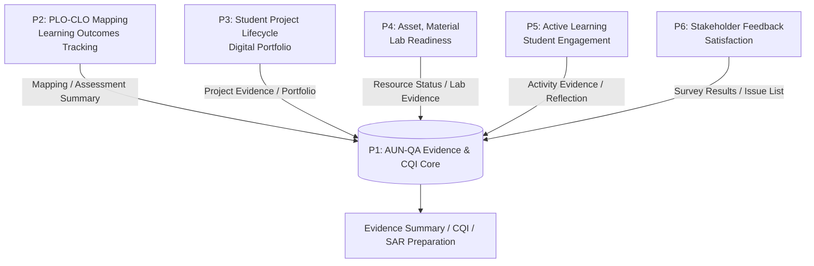

# SE AUN-QA Projects

> ศูนย์กลางข้อมูลและทรัพยากรสำหรับชุดโครงงานระบบนิเวศดิจิทัลเพื่อการบริหารหลักสูตรวิศวกรรมซอฟต์แวร์และหลักฐานคุณภาพ AUN-QA

**Repository URL:** `https://github.com/se-rmutl/se-aunqa-projects`  
**กลุ่มเป้าหมาย:** นักศึกษาวิศวกรรมซอฟต์แวร์ ชั้นปีที่ 3 และผู้เกี่ยวข้อง  
**ภาคเรียนเริ่มต้น:** 1/2569  
**สถานะ:** Project Hub / Reference Repository

## เริ่มต้นตรงนี้

1. เปิดหน้าแนะนำโครงงานแบบ Interactive ที่ [`index.html`](./index.html) หรือเปิดผ่าน GitHub Pages หลังเปิดใช้งาน repository
2. อ่านแคตตาล็อกภาพรวมที่ [`docs/Project_Topic_Catalog_1_2569_SE_Sec2.md`](./docs/Project_Topic_Catalog_1_2569_SE_Sec2.md)
3. เลือกอ่านรายละเอียดเบื้องต้นของโครงงานที่สนใจในโฟลเดอร์ [`docs/projects/`](./docs/projects/)
4. ใช้แบบร่างเอกสารใน [`templates/`](./templates/) เพื่อเตรียมหัวข้อและส่งมอบงาน

## โครงงานหลัก 6 โครงการ

| รหัส | โครงการ | เอกสาร | Visual mockup |
|---|---|---|---|
| P1 | ระบบบริหารหลักฐานคุณภาพและ CQI ตาม AUN-QA | [Project Brief](./docs/projects/P1-Evidence-Workbench/README.md) | [ภาพ](./assets/p1-dashboard.png) |
| P2 | ระบบ PLO-CLO Mapping และการติดตามผลลัพธ์การเรียนรู้ | [Project Brief](./docs/projects/P2-PLO-CLO-Mapping/README.md) | [ภาพ](./assets/p2-dashboard.png) |
| P3 | ระบบบริหารวงจรโครงงานนักศึกษาและแฟ้มสะสมผลงาน | [Project Brief](./docs/projects/P3-Student-Project-Journey/README.md) | [ภาพ](./assets/p3-dashboard.png) |
| P4 | ระบบบริหารครุภัณฑ์ วัสดุฝึก และความพร้อมห้องปฏิบัติการ | [Project Brief](./docs/projects/P4-Lab-Readiness/README.md) | [ภาพ](./assets/p4-dashboard.png) |
| P5 | ระบบบริหาร Active Learning และ Student Engagement | [Project Brief](./docs/projects/P5-Active-Learning/README.md) | [ภาพ](./assets/p5-dashboard.png) |
| P6 | ระบบบริหาร Feedback และความพึงพอใจของผู้มีส่วนได้ส่วนเสีย | [Project Brief](./docs/projects/P6-Stakeholder-Insight/README.md) | [ภาพ](./assets/p6-dashboard.png) |

## แนวคิดระบบนิเวศ

## ขอบเขตของ Repository นี้

Repository นี้เป็น **ศูนย์กลางข้อมูลร่วม** สำหรับอธิบายโจทย์ ขอบเขต ภาพต้นแบบ เอกสารตัวอย่าง และมาตรฐานการส่งมอบของแต่ละโครงการ ไม่ใช่ที่เก็บข้อมูลจริงของนักศึกษา อาจารย์ หรือผู้มีส่วนได้ส่วนเสีย

- เก็บ: เอกสารโครงการ ภาพ mockup เทมเพลต ข้อตกลงข้อมูลกลาง และคู่มือทำงาน
- ห้ามเก็บ: รหัสผ่าน API key ข้อมูลส่วนบุคคลของนักศึกษา ข้อมูลคำตอบแบบสอบถามจริง หรือไฟล์ภายในที่ไม่ได้รับอนุญาต
- Source code ของแต่ละทีมสามารถเริ่มใน repository แยกของทีม หรือสร้างใน subfolder ของโครงการเมื่อผู้สอนกำหนดรูปแบบการทำงานร่วมกันแล้ว

## ใช้งานผ่าน GitHub Pages

หลังสร้าง repository แล้ว ให้เปิด **Settings → Pages → Deploy from a branch → main / root**  
หน้าแนะนำโครงการจะอยู่ที่:

`https://se-rmutl.github.io/se-aunqa-projects/`

## การส่งงานและการทำงานร่วมกัน

อ่าน [CONTRIBUTING.md](./CONTRIBUTING.md) ก่อนสร้าง branch หรือส่ง Pull Request

## เอกสารสำคัญ

- [Shared Evidence Contract](./docs/architecture/Shared-Evidence-Contract.md)
- [โครงสร้าง Repository](./docs/Repository-Structure.md)
- [แนวทางแยก Repository ของแต่ละทีม](./docs/Team-Repository-Strategy.md)
- [Project Proposal Template](./templates/project-proposal-template.md)
- [Team Charter Template](./templates/team-charter-template.md)
- [MVP Delivery Checklist](./templates/mvp-delivery-checklist.md)

---

สร้างสำหรับหลักสูตรวิศวกรรมซอฟต์แวร์ มทร.ล้านนา เพื่อสนับสนุนการเรียนรู้แบบ Hands-on และการพัฒนาระบบที่นำไปใช้จริงได้
