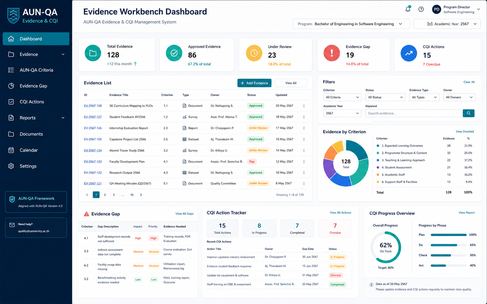

# P1. ระบบบริหารหลักฐานคุณภาพและ CQI ตาม AUN-QA
### Thai Title
**ระบบบริหารหลักฐานคุณภาพและแผนปรับปรุงอย่างต่อเนื่องตามแนวทาง AUN-QA สำหรับหลักสูตรวิศวกรรมซอฟต์แวร์**

### English Title
**AUN-QA Quality Evidence and Continuous Quality Improvement Management System for the Software Engineering Programme**

### ปัญหา
ข้อมูลและหลักฐานที่เกี่ยวข้องกับการประกันคุณภาพมักกระจัดกระจายอยู่ในหลายแหล่ง เช่น เอกสารรายวิชา รายงานกิจกรรม รายงานประชุม แบบประเมิน ภาพถ่าย และลิงก์ไฟล์ออนไลน์ ทำให้ติดตามความครบถ้วนของหลักฐานและสถานะการปรับปรุงได้ยาก โดยเฉพาะเมื่อต้องจัดทำรายงานหรือเตรียมรับการประเมิน

### วัตถุประสงค์
1. จัดเก็บและจัดหมวดหมู่หลักฐานตามเกณฑ์ AUN-QA และบริบทของหลักสูตร
2. ติดตามสถานะของหลักฐาน รวมถึงระบุช่องว่างของข้อมูลที่ยังขาด
3. บริหารรายการปรับปรุงคุณภาพ (CQI Action) ตั้งแต่การกำหนดประเด็น ผู้รับผิดชอบ กำหนดเวลา และผลการดำเนินงาน
4. เตรียมข้อมูลสำหรับนำไปใช้ในการสรุปผลและจัดทำรายงานคุณภาพในอนาคต

### ขอบเขตเริ่มต้น
- จัดการปีการศึกษา เกณฑ์ AUN-QA และรายการหลักฐาน
- อัปโหลดไฟล์หรือบันทึกลิงก์หลักฐาน
- Tag หลักฐานตาม Criterion / Sub-criterion / รายวิชา / กิจกรรม / PLO ตามความเหมาะสม
- Workflow สถานะหลักฐาน: Draft → Submitted → Reviewed → Approved / Revision
- Gap List แสดงรายการหลักฐานที่ยังไม่ครบ
- CQI Action List และการติดตามสถานะ
- ส่งออก Evidence Summary อย่างน้อยหนึ่งรูปแบบ

### ผู้ใช้หลัก
- คณะกรรมการบริหารหลักสูตร
- อาจารย์ผู้สอนและผู้รับผิดชอบรายวิชา
- ผู้รับผิดชอบงานประกันคุณภาพ
- ผู้ตรวจทานหลักฐานภายใน

### ฟังก์ชัน MVP
1. Evidence Repository และการค้นหา
2. Evidence Tagging
3. Evidence Workflow
4. Gap Dashboard
5. CQI Action Tracking
6. Export Evidence Summary / CSV

### ความเชื่อมโยง AUN-QA
- สนับสนุนการจัดการหลักฐานในทุก Criterion 1–8
- สนับสนุนวงจร PDCA และการติดตาม CQI
- เป็นฐานข้อมูลประกอบ SAR ในระยะต่อไป

### ผลลัพธ์ที่นักศึกษาต้องส่งในปลายภาค
- SRS และ Use Case ของกระบวนการจัดการหลักฐานและ CQI
- ER Diagram และ Data Dictionary เบื้องต้น
- Wireframe / Prototype สำหรับ Evidence Workbench
- MVP ที่มี workflow อย่างน้อย: เพิ่มหลักฐาน → ส่งตรวจ → ตรวจทาน → อนุมัติ/ตีกลับ
- ตัวอย่าง Gap List และ CQI Action List
- Test Case / Test Report สำหรับ workflow หลัก
- Source Code, README และ Demo Video

---

## Visual Mockup

> ภาพนี้เป็น concept UI / infographic สำหรับสื่อสารแนวทางของระบบ ไม่ใช่หน้าจอระบบที่พัฒนาเสร็จแล้ว

## การเริ่มต้นของทีม

1. สร้าง GitHub repository สำหรับทีม หรือขอสิทธิ์ใช้โครงสร้างกลางตามที่ผู้สอนกำหนด
2. คัดลอก [Project Proposal Template](../../../templates/project-proposal-template.md) ไปเป็นเอกสารของทีม
3. กำหนด MVP ให้เหลือ workflow สำคัญหนึ่งเส้นทางก่อน
4. ระบุข้อมูล/หลักฐานที่ระบบต้องส่งออกตาม [Shared Evidence Contract](../../architecture/Shared-Evidence-Contract.md)
5. ทำ Team Charter ร่วมกัน
