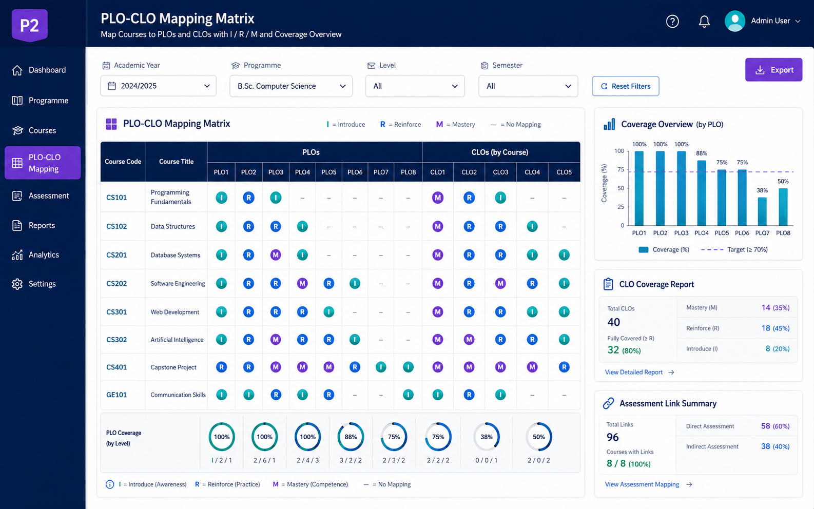

# P2. ระบบ PLO-CLO Mapping และการติดตามผลลัพธ์การเรียนรู้
### Thai Title
**ระบบบริหารความเชื่อมโยง PLO-CLO และการติดตามผลลัพธ์การเรียนรู้สำหรับหลักสูตรวิศวกรรมซอฟต์แวร์**

### English Title
**PLO-CLO Mapping and Learning Outcomes Tracking System for the Software Engineering Programme**

### ปัญหา
การบริหารหลักสูตรแบบ Outcome-Based Education ต้องแสดงความเชื่อมโยงระหว่างผลลัพธ์การเรียนรู้ระดับหลักสูตร (PLO) ผลลัพธ์การเรียนรู้ระดับรายวิชา (CLO) รายวิชา วิธีประเมิน และผลการประเมิน แต่ข้อมูลดังกล่าวมักกระจัดกระจายและตรวจสอบความครอบคลุมได้ยาก

### วัตถุประสงค์
1. จัดเก็บ PLO, Sub-PLO, CLO และข้อมูลรายวิชาที่เกี่ยวข้องอย่างเป็นระบบ
2. สร้าง Curriculum Mapping ระหว่าง PLO ↔ CLO ↔ รายวิชา
3. แสดงระดับความรับผิดชอบของรายวิชา เช่น Introduce / Reinforce / Mastery
4. ตรวจสอบช่องว่างของการสนับสนุน PLO และ CLO
5. เตรียมข้อมูลเชื่อมโยงกับวิธีประเมินและการวิเคราะห์ attainment ในอนาคต

### ขอบเขตเริ่มต้น
- จัดการข้อมูลหลักสูตร รายวิชา PLO Sub-PLO และ CLO
- สร้าง Mapping Matrix ระหว่าง PLO, CLO และรายวิชา
- ระบุระดับ I / R / M
- ผูกวิธีประเมินหรือชิ้นงานประเมินกับ CLO
- แสดงรายงาน Coverage และ Mapping Gap
- ส่งออก Curriculum Map ในรูปแบบ CSV / PDF หรือหน้า dashboard

### ผู้ใช้หลัก
- ประธานหรือคณะกรรมการบริหารหลักสูตร
- อาจารย์ผู้สอน
- ผู้ดูแลวิชาการและงานประกันคุณภาพ

### ฟังก์ชัน MVP
1. PLO / CLO Master Data Management
2. Curriculum Mapping Matrix
3. I-R-M Assignment
4. Assessment-to-CLO Link
5. Coverage / Gap Report
6. Mapping Export

### ความเชื่อมโยง AUN-QA
- Criterion 1: Expected Learning Outcomes
- Criterion 2: Programme Structure and Content
- Criterion 3: Teaching and Learning Approach
- Criterion 4: Student Assessment
- Criterion 8: Output and Outcomes

### ผลลัพธ์ที่นักศึกษาต้องส่งในปลายภาค
- SRS ของข้อมูล PLO/CLO และ Curriculum Mapping
- Use Case, ER Diagram และ Data Dictionary
- Wireframe ของหน้าจอ Mapping Matrix และรายงาน Coverage
- MVP ที่สร้าง PLO/CLO และสร้าง mapping ได้จริง
- ตัวอย่างรายงาน PLO Support Matrix / CLO Coverage Report
- Test Case / Test Report
- Source Code, README และ Demo Video

---

## Visual Mockup

> ภาพนี้เป็น concept UI / infographic สำหรับสื่อสารแนวทางของระบบ ไม่ใช่หน้าจอระบบที่พัฒนาเสร็จแล้ว

## การเริ่มต้นของทีม

1. สร้าง GitHub repository สำหรับทีม หรือขอสิทธิ์ใช้โครงสร้างกลางตามที่ผู้สอนกำหนด
2. คัดลอก [Project Proposal Template](../../../templates/project-proposal-template.md) ไปเป็นเอกสารของทีม
3. กำหนด MVP ให้เหลือ workflow สำคัญหนึ่งเส้นทางก่อน
4. ระบุข้อมูล/หลักฐานที่ระบบต้องส่งออกตาม [Shared Evidence Contract](../../architecture/Shared-Evidence-Contract.md)
5. ทำ Team Charter ร่วมกัน
