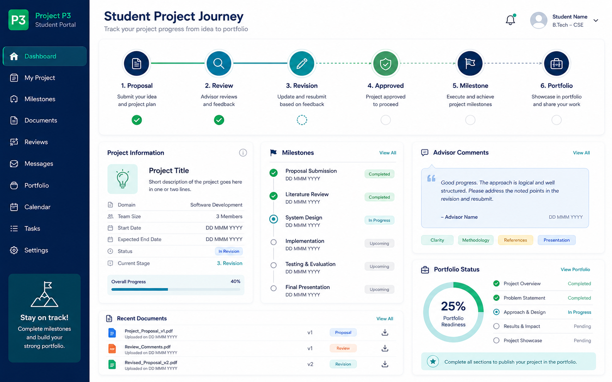

# P3. ระบบบริหารวงจรโครงงานนักศึกษาและแฟ้มสะสมผลงาน
### Thai Title
**ระบบบริหารวงจรโครงงานนักศึกษาและแฟ้มสะสมผลงานดิจิทัลสำหรับหลักสูตรวิศวกรรมซอฟต์แวร์**

### English Title
**Student Project Lifecycle and Digital Portfolio Management System for the Software Engineering Programme**

### ปัญหา
การบริหารโครงงานนักศึกษาตั้งแต่การเสนอหัวข้อ การพิจารณา การแก้ไขข้อเสนอ การนัดหมายอาจารย์ที่ปรึกษา การติดตามความก้าวหน้า และการเก็บผลงานปลายทาง มักใช้เอกสารและช่องทางสื่อสารหลายระบบ ทำให้ข้อมูลไม่ต่อเนื่องและนำมาใช้เป็น portfolio หรือหลักฐานคุณภาพได้ยาก

### วัตถุประสงค์
1. รองรับการเสนอหัวข้อและการอนุมัติหัวข้อโครงงานอย่างเป็นระบบ
2. ติดตามความก้าวหน้าตาม milestone และบันทึกการเข้าพบที่ปรึกษา
3. จัดเก็บเอกสาร ผลงาน และลิงก์ทางเทคนิคของโครงงาน
4. สร้างแฟ้มสะสมผลงานดิจิทัลที่ใช้ต่อยอดในการนำเสนอหรือสมัครงานได้
5. ส่งออกหลักฐานที่เกี่ยวข้องกับการเรียนรู้เชิงโครงงานเข้าสู่ AUN-QA Core ในอนาคต

### ขอบเขตเริ่มต้น
- เสนอหัวข้อโครงงานและแก้ไขข้อเสนอ
- Workflow การตรวจและอนุมัติหัวข้อ
- จัดการบทบาทนักศึกษา อาจารย์ที่ปรึกษา และคณะกรรมการ
- บันทึกการเข้าพบที่ปรึกษาและข้อเสนอแนะ
- กำหนด milestone และติดตามสถานะ
- อัปโหลดเอกสารหรือแนบลิงก์ GitHub / Demo / Video / Poster
- แสดง Digital Portfolio ของโครงงาน

### ผู้ใช้หลัก
- นักศึกษา
- อาจารย์ที่ปรึกษา
- คณะกรรมการโครงงาน
- ผู้ดูแลรายวิชาโครงงาน

### ฟังก์ชัน MVP
1. Topic Proposal Submission
2. Topic Review and Approval Workflow
3. Adviser Meeting Log
4. Milestone Tracking
5. Project Document Repository
6. GitHub / Demo / Video / Poster Link Management
7. Digital Portfolio Page

### ความเชื่อมโยง AUN-QA
- Criterion 3: Teaching and Learning Approach
- Criterion 4: Student Assessment
- Criterion 6: Student Support Services
- Criterion 8: Output and Outcomes

### ผลลัพธ์ที่นักศึกษาต้องส่งในปลายภาค
- SRS และ Process Model ของวงจรโครงงาน
- Use Case, Activity Diagram, ER Diagram และ Wireframe
- MVP อย่างน้อย workflow: เสนอหัวข้อ → อาจารย์ตรวจ → ส่งแก้ไข/อนุมัติ
- หน้าติดตาม milestone และ Portfolio ตัวอย่าง
- ตัวอย่าง Evidence Package ของโครงงาน 1 รายการ
- Test Case / Test Report
- Source Code, README และ Demo Video

---

## Visual Mockup

> ภาพนี้เป็น concept UI / infographic สำหรับสื่อสารแนวทางของระบบ ไม่ใช่หน้าจอระบบที่พัฒนาเสร็จแล้ว

## การเริ่มต้นของทีม

1. สร้าง GitHub repository สำหรับทีม หรือขอสิทธิ์ใช้โครงสร้างกลางตามที่ผู้สอนกำหนด
2. คัดลอก [Project Proposal Template](../../../templates/project-proposal-template.md) ไปเป็นเอกสารของทีม
3. กำหนด MVP ให้เหลือ workflow สำคัญหนึ่งเส้นทางก่อน
4. ระบุข้อมูล/หลักฐานที่ระบบต้องส่งออกตาม [Shared Evidence Contract](../../architecture/Shared-Evidence-Contract.md)
5. ทำ Team Charter ร่วมกัน
