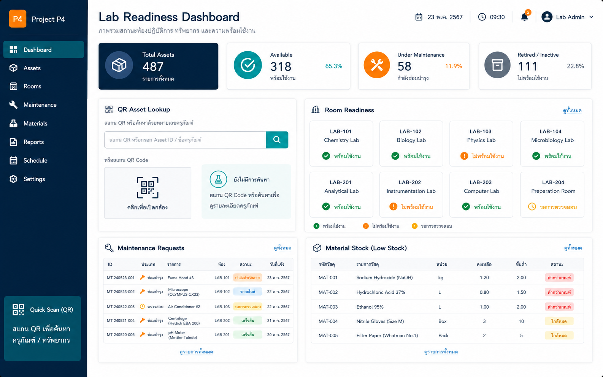

# P4. ระบบบริหารครุภัณฑ์ วัสดุฝึก และความพร้อมห้องปฏิบัติการ
### Thai Title
**ระบบบริหารครุภัณฑ์ วัสดุฝึก และความพร้อมห้องปฏิบัติการสำหรับหลักสูตรวิศวกรรมซอฟต์แวร์**

### English Title
**Asset, Training Material, and Laboratory Readiness Management System for the Software Engineering Programme**

### ปัญหา
การจัดการครุภัณฑ์ วัสดุฝึก และความพร้อมของห้องปฏิบัติการต้องติดตามข้อมูลหลายด้าน เช่น ทะเบียนครุภัณฑ์ หมายเลขทรัพย์สิน สถานะการใช้งาน การยืมคืน การซ่อมบำรุง ปริมาณวัสดุสิ้นเปลือง และความพร้อมก่อนจัดการเรียนการสอน หากข้อมูลไม่เป็นระบบจะส่งผลต่อการวางแผนทรัพยากร การดูแลรักษา และการจัดทำหลักฐานด้านสิ่งสนับสนุนการเรียนรู้

### วัตถุประสงค์
1. บริหารทะเบียนครุภัณฑ์และวัสดุฝึกการสอนอย่างเป็นระบบ
2. ติดตามสถานะพร้อมใช้ ซ่อม ยืม คืน และคงเหลือของทรัพยากร
3. สนับสนุนการตรวจสอบความพร้อมของห้องปฏิบัติการก่อนใช้งาน
4. สร้างรายงานสำหรับการบริหารทรัพยากรและหลักฐานคุณภาพ
5. ต่อยอดจากระบบบริหารครุภัณฑ์ที่เริ่มพัฒนาไว้แล้ว โดยเลือกขอบเขตที่เหมาะสมกับทีม

### ขอบเขตเริ่มต้น
- ทะเบียนครุภัณฑ์ และวัสดุสิ้นเปลือง
- รหัสทรัพย์สิน / QR Scan / ค้นหา
- บันทึกเบิกจ่าย คืน และคงเหลือของวัสดุฝึก
- สถานะครุภัณฑ์และประวัติซ่อมบำรุง
- Dashboard ความพร้อมห้องปฏิบัติการ
- รายงานเบื้องต้นตามประเภททรัพยากร ห้อง หรือสถานะ

### ผู้ใช้หลัก
- เจ้าหน้าที่ห้องปฏิบัติการ
- อาจารย์ผู้สอน
- ผู้ดูแลครุภัณฑ์
- ผู้ดูแลหลักสูตรหรือผู้บริหารที่เกี่ยวข้อง

### ฟังก์ชัน MVP
1. Asset / Material Register
2. QR Search หรือ Lookup by Asset Code
3. Material Stock In-Out
4. Maintenance History
5. Lab Readiness Checklist
6. Asset / Material Summary Dashboard

### ความเชื่อมโยง AUN-QA
- Criterion 6: Student Support Services (การสนับสนุนผู้เรียน)
- Criterion 7: Facilities and Infrastructure
- สนับสนุน Criterion 3 ในมิติความพร้อมของทรัพยากรเพื่อการจัดการเรียนการสอน

### ผลลัพธ์ที่นักศึกษาต้องส่งในปลายภาค
- SRS โดยระบุขอบเขตที่ต่อยอดจากระบบเดิมอย่างชัดเจน
- ER Diagram / Data Dictionary ของ Asset, Material, Maintenance และ Lab Readiness
- Wireframe และ Prototype ของ workflow หลัก
- MVP อย่างน้อยหนึ่ง workflow เช่น เบิกวัสดุ → อนุมัติ → ตัดสต็อก หรือค้นหาครุภัณฑ์ → ดูสถานะ → บันทึกซ่อม
- Dashboard ความพร้อมหรือรายงานสรุปอย่างน้อย 1 หน้า
- Test Case / Test Report
- Source Code, README และ Demo Video

---

## Visual Mockup

> ภาพนี้เป็น concept UI / infographic สำหรับสื่อสารแนวทางของระบบ ไม่ใช่หน้าจอระบบที่พัฒนาเสร็จแล้ว

## การเริ่มต้นของทีม

1. สร้าง GitHub repository สำหรับทีม หรือขอสิทธิ์ใช้โครงสร้างกลางตามที่ผู้สอนกำหนด
2. คัดลอก [Project Proposal Template](../../../templates/project-proposal-template.md) ไปเป็นเอกสารของทีม
3. กำหนด MVP ให้เหลือ workflow สำคัญหนึ่งเส้นทางก่อน
4. ระบุข้อมูล/หลักฐานที่ระบบต้องส่งออกตาม [Shared Evidence Contract](../../architecture/Shared-Evidence-Contract.md)
5. ทำ Team Charter ร่วมกัน
