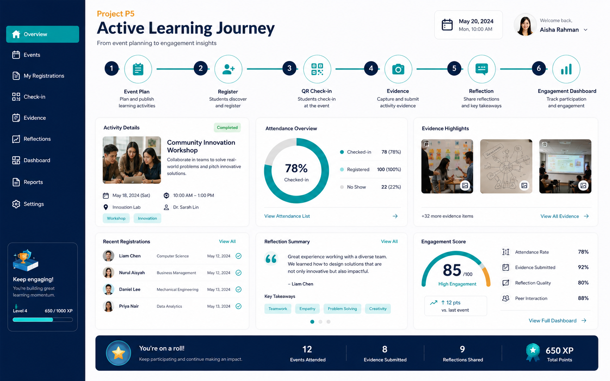

# P5. ระบบบริหาร Active Learning และ Student Engagement
### Thai Title
**ระบบบริหารกิจกรรมการเรียนรู้เชิงรุกและการมีส่วนร่วมของนักศึกษาสำหรับหลักสูตรวิศวกรรมซอฟต์แวร์**

### English Title
**Active Learning and Student Engagement Management System for the Software Engineering Programme**

### ปัญหา
กิจกรรมการเรียนรู้เชิงรุก กิจกรรมเสริมหลักสูตร Workshop Bootcamp Seminar หรือกิจกรรมพัฒนาทักษะมักมีหลักฐานกระจัดกระจาย และยังเชื่อมโยงกับผลลัพธ์การเรียนรู้ ทักษะอ่อน และผลสะท้อนของผู้เรียนได้ไม่ชัดเจน ทำให้ยากต่อการติดตามคุณค่าของกิจกรรมและการนำผลไปปรับปรุงในรอบถัดไป

### วัตถุประสงค์
1. วางแผนและบันทึกกิจกรรม Active Learning หรือกิจกรรมพัฒนานักศึกษาอย่างเป็นระบบ
2. เชื่อมโยงกิจกรรมกับ PLO, CLO, Soft Skill หรือผลลัพธ์ที่คาดหวังตามความเหมาะสม
3. บันทึกการเข้าร่วมและเก็บหลักฐานกิจกรรม
4. รวบรวม reflection และความพึงพอใจจากผู้เรียน
5. สร้างรายงานเพื่อใช้ประเมินและปรับปรุงกิจกรรมในรอบถัดไป

### ขอบเขตเริ่มต้น
- สร้างแผนกิจกรรม วัตถุประสงค์ กลุ่มเป้าหมาย และผลลัพธ์ที่คาดหวัง
- ลงทะเบียนเข้าร่วมกิจกรรม
- QR Check-in / Check-out หรือบันทึกการเข้าร่วม
- แนบภาพถ่าย เอกสาร ลิงก์ หรือหลักฐานกิจกรรม
- แบบสะท้อนผลหลังเข้าร่วมกิจกรรม
- แบบประเมินความพึงพอใจ
- Dashboard การเข้าร่วมและ Reflection Summary

### ผู้ใช้หลัก
- อาจารย์ผู้สอน
- นักศึกษา
- ผู้ประสานงานกิจกรรม
- คณะกรรมการหลักสูตร

### ฟังก์ชัน MVP
1. Activity Plan Management
2. Registration and Attendance Tracking
3. QR Check-in (หรือแนวทาง check-in ที่เหมาะสม)
4. Activity Evidence Upload
5. Reflection Form
6. Satisfaction Survey
7. Engagement Dashboard

### ความเชื่อมโยง AUN-QA
- Criterion 3: Teaching and Learning Approach
- Criterion 6: Student Support Services
- Criterion 8: Output and Outcomes

### ผลลัพธ์ที่นักศึกษาต้องส่งในปลายภาค
- SRS ของระบบกิจกรรมและการเก็บหลักฐานการมีส่วนร่วม
- Use Case, ER Diagram, Activity Flow และ Wireframe
- MVP อย่างน้อย workflow: สร้างกิจกรรม → ลงทะเบียน → check-in → reflection
- ตัวอย่าง Activity Evidence และ Reflection Summary
- Dashboard การเข้าร่วมกิจกรรมอย่างน้อย 1 หน้า
- Test Case / Test Report
- Source Code, README และ Demo Video

---

## Visual Mockup

> ภาพนี้เป็น concept UI / infographic สำหรับสื่อสารแนวทางของระบบ ไม่ใช่หน้าจอระบบที่พัฒนาเสร็จแล้ว

## การเริ่มต้นของทีม

1. สร้าง GitHub repository สำหรับทีม หรือขอสิทธิ์ใช้โครงสร้างกลางตามที่ผู้สอนกำหนด
2. คัดลอก [Project Proposal Template](../../../templates/project-proposal-template.md) ไปเป็นเอกสารของทีม
3. กำหนด MVP ให้เหลือ workflow สำคัญหนึ่งเส้นทางก่อน
4. ระบุข้อมูล/หลักฐานที่ระบบต้องส่งออกตาม [Shared Evidence Contract](../../architecture/Shared-Evidence-Contract.md)
5. ทำ Team Charter ร่วมกัน
