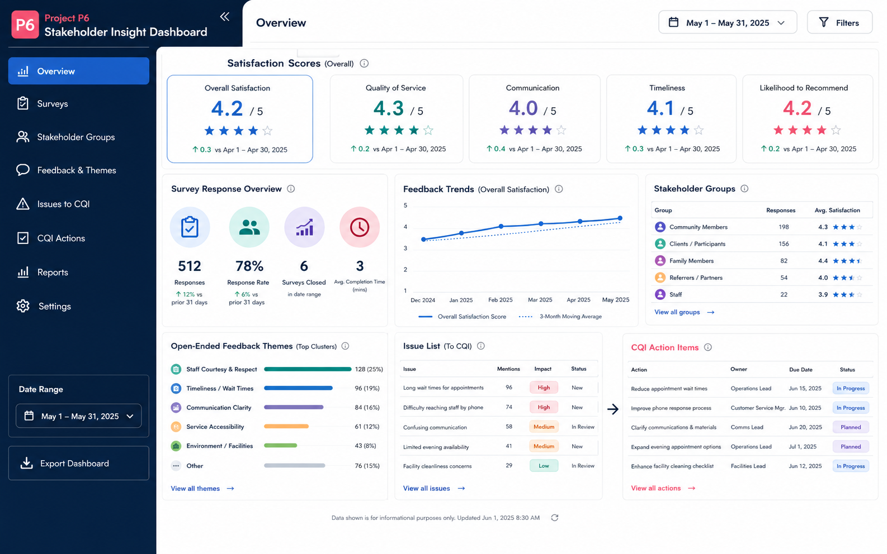

# P6. ระบบบริหาร Feedback และความพึงพอใจของผู้มีส่วนได้ส่วนเสีย
### Thai Title
**ระบบบริหารข้อมูลสะท้อนกลับและความพึงพอใจของผู้มีส่วนได้ส่วนเสียเพื่อการพัฒนาหลักสูตร**

### English Title
**Stakeholder Feedback and Satisfaction Management System for Programme Improvement**

### ปัญหา
การรับฟังความคิดเห็นจากนักศึกษา ศิษย์เก่า ผู้ใช้บัณฑิต สถานประกอบการ และผู้เกี่ยวข้องอื่นมีความสำคัญต่อการพัฒนาหลักสูตร แต่ข้อมูลจากแบบสอบถาม การสัมภาษณ์ หรือรายงานประชุมมักอยู่ในหลายรูปแบบ ทำให้วิเคราะห์แนวโน้ม สรุปประเด็น และเชื่อมผลกลับไปสู่แผนปรับปรุงได้ไม่ต่อเนื่อง

### วัตถุประสงค์
1. จัดเก็บข้อมูลกลุ่มผู้มีส่วนได้ส่วนเสียและแผนการรับฟังความคิดเห็น
2. สร้างและเผยแพร่แบบสอบถามออนไลน์ตามกลุ่มเป้าหมาย
3. สรุปคะแนนความพึงพอใจและข้อเสนอแนะปลายเปิด
4. จัดหมวดหมู่ประเด็นสะท้อนตาม PLO รายวิชา หลักสูตร หรือสิ่งสนับสนุนการเรียนรู้
5. ส่งต่อ Issue List และข้อเสนอแนะเข้าสู่กระบวนการ CQI

### ขอบเขตเริ่มต้น
- Stakeholder Directory
- Survey Template และการสร้างแบบสอบถาม
- การเก็บคำตอบแบบสอบถามออนไลน์
- Dashboard ผลคะแนนและคำตอบปลายเปิด
- Issue Categorization
- Recommendation / Issue List Export
- บันทึกการส่งต่อประเด็นเข้าสู่ CQI

### ผู้ใช้หลัก
- คณะกรรมการบริหารหลักสูตร
- ผู้รับผิดชอบงาน QA
- ผู้ประสานงานหลักสูตร
- ผู้ดูแลแบบสำรวจ
- ผู้มีส่วนได้ส่วนเสียที่ตอบแบบสอบถาม

### ฟังก์ชัน MVP
1. Stakeholder Management
2. Survey Builder แบบกำหนดคำถามพื้นฐาน
3. Survey Distribution Link
4. Response Dashboard
5. Open-ended Feedback Categorization
6. Issue List and Recommendation Export

### ความเชื่อมโยง AUN-QA
- Criterion 1: Expected Learning Outcomes (ความต้องการ stakeholder)
- Criterion 2: Programme Structure and Content
- Criterion 6: Student Support Services
- Criterion 8: Output and Outcomes / Satisfaction / Improvement

### ผลลัพธ์ที่นักศึกษาต้องส่งในปลายภาค
- SRS ของระบบบริหารข้อมูล stakeholder และแบบสำรวจ
- Use Case, ER Diagram, Data Dictionary และ Wireframe
- MVP อย่างน้อย workflow: สร้างแบบสอบถาม → เผยแพร่ → รับคำตอบ → สรุปผล
- ตัวอย่าง Satisfaction Report และ Issue List
- แนวทางส่งออกข้อมูลเพื่อใช้เป็น CQI Input
- Test Case / Test Report
- Source Code, README และ Demo Video

---

## Visual Mockup

> ภาพนี้เป็น concept UI / infographic สำหรับสื่อสารแนวทางของระบบ ไม่ใช่หน้าจอระบบที่พัฒนาเสร็จแล้ว

## การเริ่มต้นของทีม

1. สร้าง GitHub repository สำหรับทีม หรือขอสิทธิ์ใช้โครงสร้างกลางตามที่ผู้สอนกำหนด
2. คัดลอก [Project Proposal Template](../../../templates/project-proposal-template.md) ไปเป็นเอกสารของทีม
3. กำหนด MVP ให้เหลือ workflow สำคัญหนึ่งเส้นทางก่อน
4. ระบุข้อมูล/หลักฐานที่ระบบต้องส่งออกตาม [Shared Evidence Contract](../../architecture/Shared-Evidence-Contract.md)
5. ทำ Team Charter ร่วมกัน
