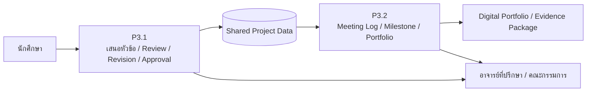

# รายงานวิเคราะห์ความสนใจหัวข้อโครงงาน  
## ระบบนิเวศดิจิทัลเพื่อการบริหารหลักสูตรและหลักฐานคุณภาพ AUN-QA  
### นักศึกษาวิศวกรรมซอฟต์แวร์ ชั้นปีที่ 2 Sec 1 | ภาคเรียน 1/2569

> **สถานะเอกสาร:** ข้อเสนอเพื่อยืนยันการจัดทีมรอบแรก  
> **แหล่งข้อมูล:** แบบสำรวจความสนใจหัวข้อโครงงาน Google Forms ที่ส่งออก ณ วันที่วิเคราะห์  
> **ขอบเขตข้อมูล:** มีคำตอบจากผู้แทนทีม 3 ชุด คาดว่าครอบคลุมนักศึกษา 9 คน (3 ทีม ทีมละ 3 คน)  
> **ข้อควรระวัง:** ผลวิเคราะห์นี้ยังไม่ใช่การจัดทีมสุดท้าย เพราะคำตอบของบางทีมมีความคลาดเคลื่อนระหว่าง “อันดับหัวข้อที่สนใจ” และช่อง “สมาชิกที่สนใจรายโครงการ” จึงต้องยืนยันกับผู้แทนทีมอีก 1 รอบ

---

## 1. สรุปผู้ตอบแบบสอบถามและภาพรวมความสนใจ

| รายการ | จำนวน / ข้อสังเกต |
|---|---|
| จำนวนผู้แทนทีมที่ตอบ | 3 คน |
| จำนวนทีมที่คาดว่าเข้าร่วม | 3 ทีม |
| จำนวนนักศึกษาที่ระบุว่าจะร่วมทีม | 9 คน |
| ขนาดทีมที่คาดหวัง | ทุกทีมระบุ 3 คน |
| รูปแบบการจัดทีม | ทุกทีมมีแนวโน้มต้องการทำงานกับกลุ่มเดิม |
| หัวข้อที่ได้รับความสนใจอันดับ 1 | P3 จำนวน 2 ทีม, P6 จำนวน 1 ทีม |
| หัวข้อที่ยังไม่มีทีมเลือกอันดับ 1 | P1, P2, P4 และ P5 |
| หัวข้อที่ไม่มีการเลือกเลย | P5 |

### 1.1 การกระจายความสนใจตามอันดับที่ระบุ

| โครงการ | อันดับ 1 | อันดับ 2 | อันดับ 3 | สรุปความสนใจ | สถานะปัจจุบัน |
|---|---:|---:|---:|---:|---|
| P1 ระบบบริหารหลักฐานคุณภาพและ CQI ตาม AUN-QA | 0 | 0 | 2 | 2 | มีความสนใจระดับรอง แต่ยังไม่มีทีมพร้อมเริ่ม |
| P2 ระบบ PLO-CLO Mapping และการติดตามผลลัพธ์การเรียนรู้ | 0 | 1 | 0 | 1 | มีความสนใจแฝง แต่แนวคิด OBE/AUN-QA ยังยากสำหรับนักศึกษา |
| P3 ระบบบริหารวงจรโครงงานนักศึกษาและแฟ้มสะสมผลงาน | 2 | 0 | 0 | 2 | ได้รับความนิยมสูงสุดและมีทีมพร้อม 2 ทีม |
| P4 ระบบบริหารครุภัณฑ์ วัสดุฝึก และความพร้อมห้องปฏิบัติการ | 0 | 1 | 1 | 2 | มีความสนใจระดับรอง เหมาะสำหรับนำเสนอขอบเขตที่ต่อยอดจากระบบเดิม |
| P5 ระบบบริหาร Active Learning และ Student Engagement | 0 | 0 | 0 | 0 | **ช่องว่างสูงสุด ต้องสื่อสารใหม่ก่อนเปิดรับทีมรอบถัดไป** |
| P6 ระบบบริหาร Feedback และความพึงพอใจของผู้มีส่วนได้ส่วนเสีย | 1 | 1 | 0 | 2 | มีทีมอันดับ 1 พร้อมเริ่ม และมีอีกทีมมองเป็นทางเลือกอันดับ 2 |

> การนับในตารางนี้นับจาก “อันดับที่สนใจ” ของผู้แทนทีม เพราะช่องเลือกหลายโครงการและช่องสมาชิกรายโครงการมีการกรอกไม่สอดคล้องกันบางส่วน

---

## 2. ข้อเสนอการจัดกลุ่มรอบแรก

### กลุ่ม A — P6: ระบบบริหาร Feedback และความพึงพอใจของผู้มีส่วนได้ส่วนเสีย

**ชื่อทีมตามแบบสอบถาม:** Hungry engineer  
**สมาชิกที่ระบุในช่อง P6**
1. 67543210004-7 — พิชิรกร ชาติปิระ  
2. 67543210023-7 — วรรธนะ คำมาลัย  
3. 67543210049-2 — อติโรจน์ กุหลั่น  

**หัวข้อที่เลือก:** P6 เป็นอันดับ 1, P2 เป็นอันดับ 2 และ P1 เป็นอันดับ 3

**ข้อเสนอขอบเขตย่อยที่ควรรับผิดชอบ**
- Stakeholder Directory และการกำหนดกลุ่มผู้ตอบแบบสอบถาม
- Survey Template / Survey Distribution
- Dashboard คะแนนความพึงพอใจ
- การจัดหมวดหมู่ข้อเสนอแนะปลายเปิด
- Issue List และการส่งต่อประเด็นเข้าสู่ CQI Action

**เหตุผลที่เหมาะสม**
- ทีมสนใจ UI/UX, Dashboard และ Survey โดยตรง
- มีพื้นฐานเว็บ, React/Node.js, ฐานข้อมูล, API, Figma, Postman และ Google Forms/Sheets/Apps Script
- เหตุผลที่เลือกหัวข้อสะท้อนความเข้าใจว่า feedback เป็นฐานข้อมูลเพื่อการปรับปรุงจริง ไม่ใช่เพียงการทำแบบสอบถาม

**ความท้าทาย**
- ต้องแยกให้ชัดระหว่าง “P6: feedback ของ stakeholder” กับ “P5: feedback/reflection หลังทำกิจกรรม”
- ต้องออกแบบแบบสอบถามและการสรุปข้อมูลให้ใช้เชิงตัดสินใจได้จริง
- ไม่ควรเริ่มจาก NLP/AI วิเคราะห์ข้อความทันที; รุ่นแรกควรใช้การจัดหมวดหมู่ด้วยคนหรือ rule-based ที่ตรวจสอบได้

**สิ่งที่ควรสนับสนุนก่อนเริ่ม**
- Workshop AUN-QA/OBE ฉบับผู้พัฒนา
- Workshop Use Case / Activity Diagram / ER Diagram
- Template Milestone และตัวอย่าง Dashboard/Report

**จุดต้องยืนยัน**
- พบชื่อ “อติโรจน์ กุหลั่น” อยู่ในช่องสมาชิก P5 ด้วย ทั้งที่ทีมจัดอันดับ P6/P2/P1 จึงควรยืนยันว่าทีมเลือก P6 เป็นหัวข้อสุดท้ายจริง

---

### กลุ่ม B — P3.1: ระบบเสนอหัวข้อและกระบวนการพิจารณาโครงงาน

**ชื่อทีมตามแบบสอบถาม:** Syntax Error 3  
**สมาชิกที่คาดว่าจะทำงานร่วมกัน**
1. 675432100252 — ชนสรณ์ บุตรถา  
2. 675432100716 — เบจศรายุทธ น้อยอุบล  
3. 675432100336 — ธาวัน ทิพคุณ  

**หัวข้อที่เลือก:** P3 เป็นอันดับ 1, P4 เป็นอันดับ 2 และ P1 เป็นอันดับ 3

**ข้อเสนอขอบเขตย่อยที่ควรรับผิดชอบ**
- Proposal Submission
- Review / Comment / Revision / Approval Workflow
- บทบาทนักศึกษา อาจารย์ที่ปรึกษา และคณะกรรมการโครงงาน
- Versioning เอกสารข้อเสนอ
- การแจ้งเตือนและสถานะการพิจารณา

**เหตุผลที่เหมาะสม**
- เหตุผลที่ตอบแบบสอบถามชัดเจนและยึดปัญหาจริง: การเสนอหัวข้อ การติดตาม และการรวบรวมผลงานกระจัดกระจาย
- มีประสบการณ์กว้างที่สุดในชุดคำตอบ ได้แก่ Web, Desktop/Mobile, Database, Requirement/UML, UI/UX, Testing และ Git/GitHub
- ระบุความสนใจครอบคลุม UI/UX, Database, API, Dashboard และ Testing จึงเหมาะกับ workflow ที่มี business rule ชัดเจน

**ความท้าทาย**
- ต้องกำหนดกติกา workflow ให้สอดคล้องกับวิธีทำงานจริงของรายวิชา/คณะกรรมการ
- ต้องไม่ขยายไปทำทุกอย่างของ P3 ในทีมเดียว เพราะจะซ้ำกับทีม P3.2
- ต้องออกแบบ API/Data Contract ร่วมกัน เช่น Project, Proposal, Review, Approval, Member, Adviser

**สิ่งที่ควรสนับสนุนก่อนเริ่ม**
- Session เก็บ requirement กับอาจารย์ผู้รับผิดชอบโครงงาน
- ตัวอย่าง SRS/Wireframe/Source code ของระบบ workflow
- Definition of Done และเกณฑ์ทดสอบแต่ละสถานะ

**จุดต้องยืนยัน**
- ช่องสมาชิก P1/P3/P4 ของคำตอบมีการแยกชื่อสมาชิกคนละโครงการ แต่ทีมระบุว่าต้องการทำกับเพื่อนกลุ่มเดิม จึงควรยืนยันว่าทั้ง 3 คนยอมรับ P3.1 เป็นหัวข้อร่วมกัน

---

### กลุ่ม C — P3.2: ระบบติดตาม Milestone การเข้าพบที่ปรึกษา และ Digital Portfolio

**ชื่อทีมตามแบบสอบถาม:** ยังไม่ได้ระบุชื่อทีม  
**สมาชิกที่ระบุในช่อง P3**
1. 67543210066-6 — ศุภโชค แสงจันทร์  
2. 67543210056-7 — ณัฐสิทธิ์ มะโนชัย  
3. 67543210053-4 — ฐิติภัทร์ ชุ่มมา  

**หัวข้อที่เลือก:** P3 เป็นอันดับ 1, P6 เป็นอันดับ 2 และ P4 เป็นอันดับ 3

**ข้อเสนอขอบเขตย่อยที่ควรรับผิดชอบ**
- Adviser Meeting Log
- Milestone Plan / Progress Tracking
- Project Document Repository
- GitHub / Demo / Video / Poster Link
- Portfolio Readiness Dashboard

**เหตุผลที่เหมาะสม**
- ทีมระบุปัญหาตรงกับโมดูลนี้: การนัดหมายอาจารย์ที่ปรึกษาและการติดตามงานรายสัปดาห์
- สนใจ UI/UX, Testing, Dashboard และ Database ซึ่งเหมาะกับงานติดตามความก้าวหน้าและ portfolio
- มีประสบการณ์ระดับพื้นฐานด้าน Web, Database, UML, Figma, Testing และ Git/GitHub

**ความท้าทาย**
- ทีมยังไม่มั่นใจด้านการเขียนโปรแกรม จึงควรกำหนด MVP แบบชัดเจนและลดความซับซ้อนของ backend ในระยะแรก
- ต้องกำหนดขอบเขตให้แยกจาก P3.1 อย่างเด็ดขาด แต่ใช้ข้อมูลกลางร่วมกัน
- ควรวางโครงสร้างข้อมูลและสิทธิ์การเข้าถึงให้เรียบง่ายก่อน เช่น นักศึกษา/ที่ปรึกษา/ผู้ดูแล

**สิ่งที่ควรสนับสนุนก่อนเริ่ม**
- Workshop Front-end / Back-end / Database แบบต่อเนื่อง
- Starter Repository พร้อมโครงสร้าง Project / API / Database
- ตัวอย่าง SRS, Wireframe และ Test Case

---

## 3. โครงสร้างความสัมพันธ์ของ P3.1 และ P3.2

เพื่อให้ทั้งสองทีมส่งงานแยกได้ แต่ระบบทำงานร่วมกัน ควรแบ่ง P3 เป็น 2 โครงงานย่อยใต้โดเมนเดียวกันดังนี้

### Shared Data Contract ที่ควรตกลงร่วมกัน

| ข้อมูลกลาง | เจ้าของข้อมูลหลัก | ผู้ใช้ข้อมูลต่อ |
|---|---|---|
| Student / Team / Adviser | P3.1 | P3.2 |
| Project Title / Proposal / Project Status | P3.1 | P3.2 |
| Approved Project ID | P3.1 | P3.2 |
| Meeting Log / Milestone | P3.2 | P3.1 ใช้แสดงสถานะโดยสรุปได้ |
| Portfolio Links / Evidence | P3.2 | P1 หรือ AUN-QA Core ในระยะต่อไป |

---

## 4. หัวข้อที่ยังมีช่องว่าง และสาเหตุที่นักศึกษาอาจยังไม่ลงชื่อ

### P5 — ช่องว่างสูงสุด: Active Learning และ Student Engagement

**หลักฐานจากแบบสอบถาม:** ไม่มีทีมใดเลือก P5 ทั้งในอันดับ 1–3 และไม่มีการเลือกในรายการความสนใจรวม

**การตีความ**
- ชื่อโครงการอาจฟังเหมือน “ระบบลงทะเบียนกิจกรรมทั่วไป” จึงไม่เห็นความท้าทายเชิงวิศวกรรมซอฟต์แวร์
- นักศึกษาอาจยังไม่เห็นว่าระบบนี้สามารถเชื่อม QR check-in, หลักฐานภาพ/เอกสาร, reflection, soft skill, certificate และ dashboard ได้
- อาจสับสนกับ P6 เพราะทั้งสองมีคำว่า feedback/satisfaction

**ข้อเสนอการสื่อสารใหม่**
- เปลี่ยนชื่อเพื่อสื่อประโยชน์กับนักศึกษาเป็น  
  **“SE Learning Experience & Activity Portfolio”**  
  หรือ  
  **“ระบบกิจกรรมการเรียนรู้และ Portfolio การมีส่วนร่วมของนักศึกษา”**
- ใช้ตัวอย่างจริง: Bootcamp, Workshop, Industrial Visit, Seminar, Hackathon, Career Activity
- สาธิต flow ที่จับต้องได้: `สร้างกิจกรรม → ลงทะเบียน → QR Check-in → แนบหลักฐาน → Reflection → ได้ record ใน portfolio`
- ย้ำว่างานนี้เหมาะกับผู้สนใจ Mobile UI, QR, Camera, Event workflow, Dashboard, Certificate และ Gamification

### P1 — ความสำคัญสูง แต่ภาพการใช้งานยังนามธรรม

**หลักฐานจากแบบสอบถาม:** ไม่มีทีมเลือกอันดับ 1 แต่มี 2 ทีมวางเป็นอันดับ 3

**การตีความ**
- นักศึกษารับรู้ว่าจำเป็น แต่ยังไม่เห็นผู้ใช้และประโยชน์เชิงหน้าจอที่ชัดเจน
- ผู้ตอบ 2 จาก 3 ทีมระบุความกังวลว่า “ยังไม่เข้าใจภาพรวม AUN-QA / OBE” จึงเป็นอุปสรรคโดยตรงต่อ P1

**ข้อเสนอการสื่อสารใหม่**
- ใช้โจทย์เล็กแทนคำว่า “AUN-QA ทั้งหมด” เช่น  
  `เก็บหลักฐาน → Tag → Review → พบ Gap → สร้าง CQI Action`
- ทำ workshop 45 นาทีที่ให้นักศึกษาลองจัดหลักฐานกิจกรรมจริงเข้าสู่ Criterion 3, 6, 7 หรือ 8
- กำหนด MVP ให้ชัดว่าเริ่มเพียง 2–3 criteria ไม่ใช่ทำครบ 1–8

### P2 — ช่องว่างด้านความรู้โดเมน OBE/PLO/CLO

**หลักฐานจากแบบสอบถาม:** ไม่มีทีมเลือกอันดับ 1; มี 1 ทีมเลือกอันดับ 2 แต่ไม่มีการเลือกในรายการความสนใจรวม

**การตีความ**
- PLO/CLO/IR/M เป็นศัพท์ที่นักศึกษายังไม่คุ้น โดยเฉพาะในระดับชั้นปีที่ 2
- อาจถูกมองว่าเป็นงานเอกสารหลักสูตร ไม่ใช่งานระบบที่ผู้พัฒนาเห็นผลลัพธ์ได้ทันที
- ผู้ตอบทีมที่สนใจ P2 เองก็ระบุความกังวลเรื่อง AUN-QA/OBE และการออกแบบ database

**ข้อเสนอการสื่อสารใหม่**
- ใช้ตัวอย่างรายวิชาจริง 1 วิชา: `CLO → วิธีประเมิน → คะแนน → PLO Coverage`
- ให้เห็น Matrix I/R/M และ dashboard ว่า “PLO ใดไม่มีวิชารองรับ”
- แตก MVP เป็น `Course + CLO + PLO Matrix + Coverage Report` ก่อน ไม่เริ่มจากระบบประเมิน attainment เต็มรูปแบบ

### P4 — มีความสนใจรอง แต่ยังไม่เห็นเส้นทางต่อยอดจากระบบที่มีอยู่

**หลักฐานจากแบบสอบถาม:** ไม่มีทีมเลือกอันดับ 1; มี 2 ทีมเลือกเป็นอันดับ 2/3

**การตีความ**
- นักศึกษาอาจคิดว่าเป็นระบบทะเบียนครุภัณฑ์ธรรมดา หรือคิดว่างานเริ่มไปแล้วจึงไม่ทราบว่าจะทำส่วนใดต่อ
- งานเกี่ยวข้องกับ asset/QR/maintenance/lab readiness อาจดูเหมือนงานธุรการมากกว่างาน software project

**ข้อเสนอการสื่อสารใหม่**
- แสดงของเดิมที่พัฒนาแล้ว และประกาศ “ขอบเขตย่อยที่ยังว่าง” ให้ชัด เช่น  
  1) วัสดุฝึกและเบิกจ่าย  
  2) Lab Readiness Dashboard  
  3) QR Mobile Scan / Borrow-Return  
  4) Maintenance Workflow
- ย้ำว่านี่คือระบบที่ใช้กับห้องปฏิบัติการจริง มี QR, mobile camera, dashboard, role-based workflow และรายงาน

---

## 5. ความพร้อมด้านทักษะและแผนสนับสนุนก่อนเริ่ม

| ความต้องการ/ความกังวล | หลักฐานจากคำตอบ | แนวทางสนับสนุนที่แนะนำ |
|---|---|---|
| AUN-QA / OBE ยังไม่ชัด | ผู้แทน 2 จาก 3 ทีมระบุโดยตรง | Workshop “AUN-QA สำหรับนักพัฒนาระบบ” พร้อม use case จริง |
| การออกแบบระบบ/UML/Database | ทีม P6 ระบุความกังวล และขอ workshop | Workshop Use Case, Activity Diagram, ER Diagram, API Contract |
| ความมั่นใจในการเขียนโปรแกรม | ทีม P3.2 ระบุความกังวล | Starter Repository, Code Walkthrough, Pair Review |
| การทำงานร่วมกันด้วย Git/GitHub | ทีม P6 ระบุความกังวล | Git Flow ขนาดเล็ก, Issue/Branch/PR Template |
| เวลาและการเริ่มต้นโครงงาน | ทีม P6 ระบุชัด | Milestone Template, Backlog, Weekly Check-in |
| ต้องการตัวอย่างงานต้นแบบ | P3.1 และ P3.2 ขอ SRS/Wireframe/Source Code | แจก Starter Pack รายหัวข้อ + ตัวอย่าง Definition of Done |

---

## 6. ข้อเสนอเชิงตัดสินใจสำหรับอาจารย์ผู้ดูแล

1. **ยืนยัน 3 ทีมแรกตามความสนใจเดิมก่อน** โดยยังไม่บังคับย้ายสมาชิกออกจากกลุ่มเดิม  
   - P6: Hungry engineer  
   - P3.1: Syntax Error 3  
   - P3.2: ทีมของณัฐสิทธิ์ / ศุภโชค / ฐิติภัทร์  

2. **กำหนด P3.1 และ P3.2 เป็นโครงงานแยกส่งได้** แต่ต้องใช้ Shared Data Contract และมีจุด integration อย่างน้อยหนึ่ง workflow

3. **ยังไม่ควรเปิด P1/P2/P4/P5 เป็นหัวข้อสุดท้ายทันที** จนกว่าจะมีรอบอธิบาย/สาธิต domain และ MVP ที่จับต้องได้

4. **ทำ “Project Topic Showcase รอบที่ 2” 60–90 นาที** โดยมี  
   - demo/mockup P1–P6  
   - ตัวอย่าง user journey  
   - scope ที่ไม่เกิน 1 ภาคการศึกษา  
   - รายการทักษะที่จะได้จากแต่ละหัวข้อ  
   - ท้าย session ให้เลือกหัวข้อใหม่อีกครั้ง

5. **ใช้แบบฟอร์มยืนยันรอบสุดท้าย** เพื่อแก้ข้อมูลที่ไม่สอดคล้อง เช่น ชื่อสมาชิกที่ถูกกรอกข้ามช่องโครงการ และยืนยันว่าแต่ละทีมเลือกหัวข้อใดเป็น final choice

---

## 7. สรุป

ข้อมูลชุดแรกสะท้อนว่า นักศึกษาเลือกหัวข้อที่ใกล้ตัวและเห็นปัญหาการใช้งานทันที ได้แก่ **P3 ระบบโครงงานนักศึกษา** และ **P6 ระบบ feedback** ขณะที่หัวข้อ P1/P2/P4/P5 ไม่ได้ถูกปฏิเสธ แต่ยังต้องแปล “ภาษาการประกันคุณภาพ/การบริหารหลักสูตร” ให้เป็น workflow และหน้าจอที่นักศึกษามองเห็นคุณค่าของการพัฒนาได้

หัวข้อที่ต้องเร่งสื่อสารใหม่มากที่สุดคือ **P5** ตามด้วย **P1 และ P2** ซึ่งถูกจำกัดด้วยช่องว่างด้านความเข้าใจ AUN-QA/OBE ส่วน **P4** มีโอกาสดึงความสนใจได้ หากประกาศขอบเขตย่อยที่ต่อยอดจากระบบครุภัณฑ์เดิมให้ชัดเจน

